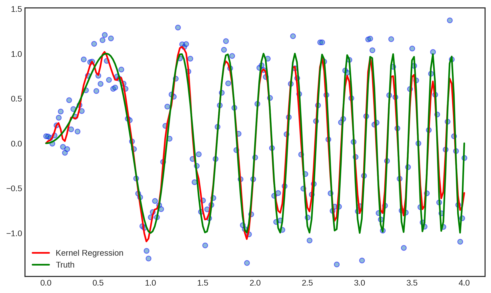

# Intro to Locally Weighted Linear Regression

## What is Locally Weighted Linear Regression?

### "Linear Regression" 

Linear regression is a modeling technique that uses linear combinations of the
input data to give a prediction of the dependent variable's value for a given point.
The general form of the equation that defines a linear regression model is as follows: 

$$\large y = X\cdot\beta +\sigma\epsilon $$

where 
- $y \rightarrow$ vector of the dependent variable values
- $X \rightarrow$ matrix of observations
- $\beta \rightarrow$  a vector of coefficients calculated by minimizing the SSE of the observed y values
from the predicted y values
- $\epsilon \rightarrow$ random error 


In order to calculate the $\beta$ coefficients, we must solve for $\beta$. To get our 
matrix of features on the other side of the equation, we will have to multiply by its 
inverse which is only possible if the matrix is invertible, and necessarily square. 
Multiplying X by its transpose will make it into a (likely) invertible square matrix: 

$$\large  X^Ty = X^TX\beta +\sigma X^T\epsilon$$

And after checking that $X^TX$ is invertible, we can solve for $\beta$:

$$\large \beta = (X^TX)^{-1}(X^Ty) - \sigma (X^TX)^{-1}X^T\epsilon$$

We can never truly know the random error term, so we take an estimate:

$$\large \bar{\beta} = (X^TX)^{-1}(X^Ty)$$

Finally, we can plug in our estimated $\beta$ coefficients and obtain 
our linear regression equation to use for predictions:

$$\large \hat{y} = X(X^TX)^{-1}(X^Ty)$$

Linear regression can be a great method for modeling and predicting linear data, but 
it cannot directly be applied to non-linear trends, like in the image below:


### "Locally"

If you tried to draw a single line through that data, the predictions would be very poor. 
However, if you break the data up into smaller segments/datasets, you can apply 
linear regression to these miniature datasets and draw a linear regression line for each one.
This calculus-like approach approximates the true curve of the line with multiple small, 
linear models. This way, when you are making a prediction for a new observation, you can 
localize the problem to a smaller neighborhood of the data: 


### "Weighted" 

So how do we localize the data? We use what is known as a **kernel function** which assigns each
data point a **weight** based on how far that point is from a central point. The kernel looks like 
a bell-shaped curve, so that points that fall outside of the scope of the kernel receive a value of 0.
For LOWESS, each point that we are trying to predict will be the center point for the kernel, giving
us a matrix of weights. 

The kernel width is defined by a hyperparameter called tau, $\tau$:


Here are some examples of kernel functions that may be used:

1.   The Exponential Kernel

$$ K(x):= e^{-\frac{\|x\|^2}{2\tau}}$$


2.   The Tricubic Kernel

$$ K(x):=\begin{cases}
(1-\|x\|^3)^3 \;\;\;if \;\;\; \|x\|<1 \\
0 \;\;\; \text{otherwise}
\end{cases}
$$

3.   The Epanechnikov Kernel

$$ K(x):=\begin{cases}
\frac{3}{4}(1-\|x\|^2) \;\;\;if \;\;\; \|x\|<1 \\
0 \;\;\; \text{otherwise}
\end{cases}
$$

3.   The Quartic Kernel

$$ K(x):=\begin{cases}
\frac{15}{16}(1-\|x\|^2)^2 \;\;\;if \;\;\; \|x\|<1 \\
0 \;\;\; \text{otherwise}
\end{cases}
$$


## Code implementations

It is first necessary to import some packages: 

```
import numpy as np
import pandas as pd
from math import ceil
from scipy import linalg
from scipy.interpolate import interp1d
from sklearn.ensemble import RandomForestRegressor
from sklearn.linear_model import LinearRegression
import scipy.stats as stats
from sklearn.model_selection import train_test_split as tts, KFold
from sklearn.metrics import mean_squared_error as mse
```

Create a general linear regression model:

```
lm = LinearRegression()
```

Define the kernels: 

```
# Tricubic Kernel
def tricubic(x):
  return np.where(np.abs(x)>1,0,70/81*(1-np.abs(x)**3)**3)
  
# Epanechnikov Kernel
def Epanechnikov(x):
  return np.where(np.abs(x)>1,0,3/4*(1-np.abs(x)**2)) 
  
# Quartic Kernel
def Quartic(x):
  return np.where(np.abs(x)>1,0,15/16*(1-np.abs(x)**2)**2) 
```

Define the general kernel function: 
```
def kernel_function(xi,x0,kern, tau): 
    return kern((xi - x0)/(2*tau))
```

Since we are going to be generating regression lines from 
multiple point, our weights will take the form of a weights 
matrix, where each column vector represents the weights 
calculated based on a given point: 

```
# x is our vector of observations, 
# x_new are the points that we want to predict
def weights_matrix(x,x_new,kern,tau):
  if np.isscalar(x_new): # if you input a scaler
    return kernel_function(x,x_new,kern,tau)
  else: 
    n = len(x_new)
    # generate a vector of weights centered at each new value
    return np.array([kernel_function(x,x_new[i],kern,tau) for i in range(n)]) 

```

Here is our basic LOWESS function:

```
# this function is designed to be trained by one set of data, 
# and to predict another

# you are centering the kernel at the new data and producing
# weights based on the old data

# so if you have 10 data points, you solve 10 linreg problems and
# create 10 predictions

def lowess(x, y,x_new, kern, tau=0.05): # x_new should be the testing data
    # tau is called bandwidth K((x-x[i])/(2*tau))
    # tau is a hyper-parameter
    w = weights_matrix(x,x_new,kern,tau) 
    if np.isscalar(x_new):
      lm.fit(np.diag(w).dot(x.reshape(-1,1)),np.diag(w).dot(y.reshape(-1,1)))
      yest = lm.predict([[x_new]])[0][0]
    else:
      # if it is not a scaler, then you get n predictions & n weights
      n = len(x_new)
      yest = np.zeros(n)
      #Looping through all x-points
      for i in range(n):
        # solve n linear regressions
        lm.fit(np.diag(w[i,:]).dot(x.reshape(-1,1)),np.diag(w[i,:]).dot(y.reshape(-1,1)))
        yest[i] = lm.predict(x_new[i].reshape(-1,1)) 

    return yest
```


### Example 
Using randomly-generated noisy sin data, we can test our function and generate
the following plot: 




<!---   ---> 


